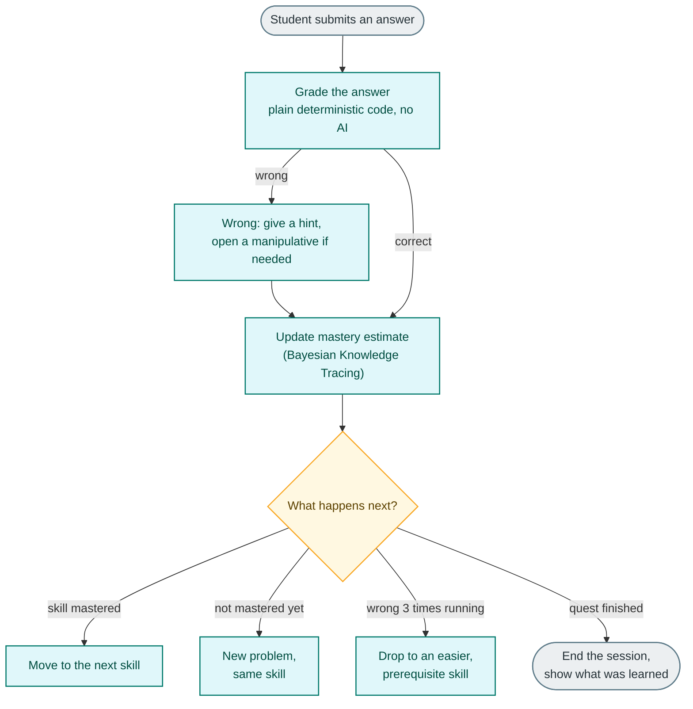
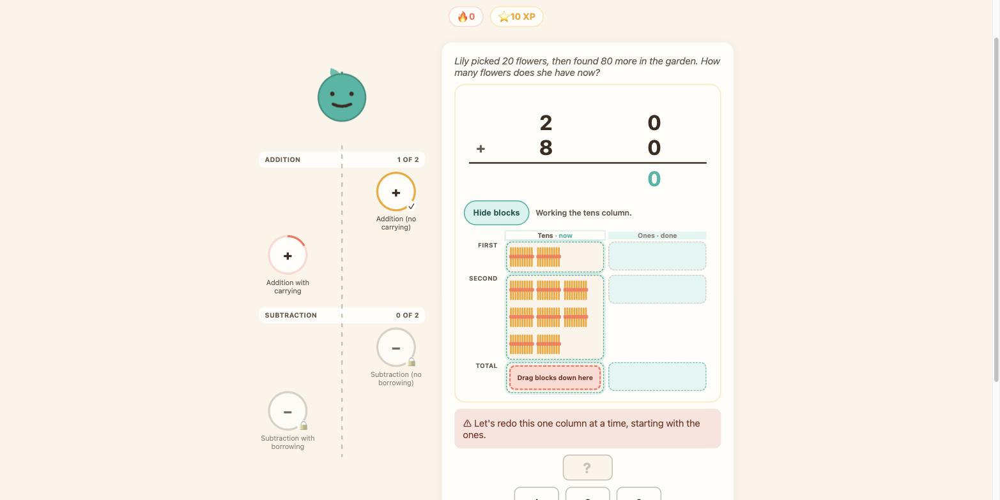
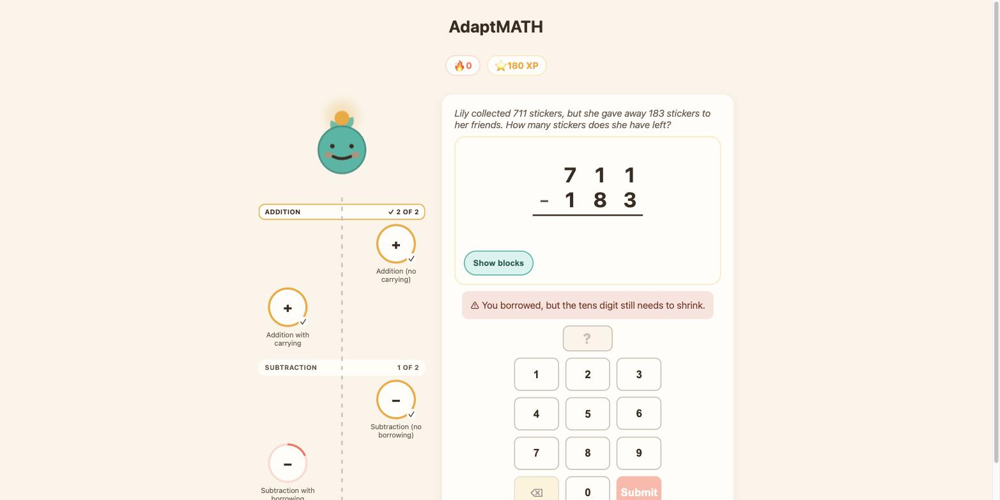
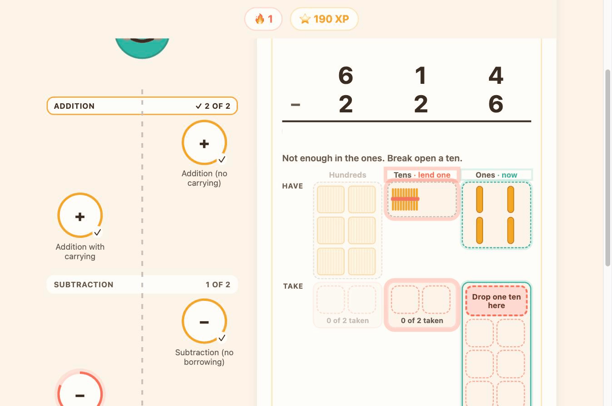
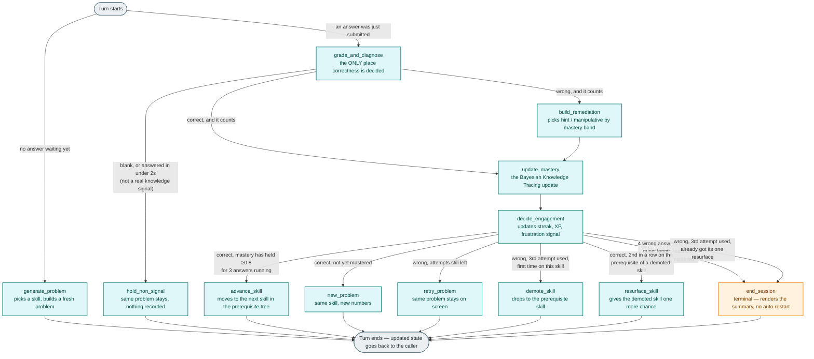

# AdaptMATH

A K-5 adaptive math learning app built for the Nerdy AI Hackathon (Prompt 01: K-5 Math Game).

*A short overview follows below; implementation detail lives past the divider under [Developer reference](#developer-reference).*

> **Looking for the live demo?** The deployed URL is on the hackathon submission form, not in this repo. Every mastery moment calls the OpenAI API for narration off a small, shared credit budget — publishing the link here risks a spike of traffic burning through it before a judge opens the page, leaving the demo dead for everyone after. Running it locally (below) sidesteps that entirely: the app works fully **without** an API key, since every narrative call fails open to plain hardcoded copy when one isn't set.
>
> Prefer to just watch it work first? Here's an unlisted walkthrough: [youtu.be/lPKNvPYhSEY](https://youtu.be/lPKNvPYhSEY).

**Contents:** [the core idea](#the-one-idea-everything-follows-from) · [how a turn is decided](#how-one-answer-becomes-a-decision) · [screenshots](#see-it-in-action) · [what's built](#whats-built) · [does it work?](#does-the-adaptive-engine-actually-help) · [developer reference](#developer-reference)

## The one idea everything follows from

**Grading, mastery tracking, and curriculum selection are a deterministic state machine — an LLM never touches them.** A student's mastery of each skill is tracked with Bayesian Knowledge Tracing (BKT), wrong answers are diagnosed against a catalog of known misconception rules instead of just marked wrong, and what problem to serve next falls out of that real data. The only four places an LLM is allowed to speak are *narrating* what already happened — never deciding it.

## How one answer becomes a decision



This is a deliberate simplification (the real graph has 12 nodes and 15 labeled edges — see the full diagram in [Developer reference](#developer-reference)), but nothing here is dumbed down: grading (box 1) is plain code, so nothing in this app can hallucinate a wrong answer into a right one; "skill mastered" (the diamond) means the estimate held at or above 0.8 across three consecutive answers, not merely crossed it once, so one lucky guess can't finish a skill; and the whole path from submit to verdict measures 6–15ms server-side in practice, because nothing on it ever calls a network — the LLM only speaks afterward, off to the side.

## What's built

- A skill tree of two parent skills (Addition, Subtraction), each with two sub-skills, every sub-skill tracked by its own independent BKT mastery value and gated by the sustained-mastery rule above
- A 13-bug-type misconception catalog across addition/subtraction, plus 2 cross-cutting rules — every hint machine-checked at 12 words or fewer, with hint/visual copy kept as data (`content/misconceptions.json`) so retuning wording never touches engine code
- A 3-attempt retry ladder: a wrong answer keeps the *same* problem on screen, the correct answer is never shown before attempt 3, and a third miss demotes to the prerequisite skill (with one chance to resurface later)
- Three manipulatives — base-ten blocks, a number line, a ten-frame — delivered strictly as remediation: never shown on attempt 1 at any mastery level, and faded in by live mastery band (pre-loaded with the student's own answer / one tap away / hint-only)
- Four LLM narrative touchpoints, fail-open to plain copy, isolated to one file and traced to LangSmith
- Seeded demo profiles (`?seed=new|struggling|fluent|borrowing`) plus refresh-mid-session and backend-restart recovery via `localStorage`
- A number pad, a skill trail map, a growth-stage mascot, and an end-of-quest report that names the specific misconceptions repaired — playable at tablet-landscape (1024×768) and up
- A synthetic-student evaluation harness that checks whether any of this actually helps (next section)

## See it in action

Real states from the running app (tablet-landscape, 1024×768) — not mockups. Regrouping is one mechanic in two directions, ten ones bundling into a ten and one ten breaking back into ten ones, and these catch it running both ways.

**Carrying, regrouping upward.** The word problem is one of the four LLM touchpoints (flavor text wrapped around a plain numeric problem); the hint below it is plain deterministic code naming *why* the answer was wrong, never just that it was. Because this student's mastery on this skill is still below 0.4, attempt 2 opens the base-ten blocks automatically, pre-loaded with her own wrong answer — nothing here is a fixed "try again."



**Borrowing, diagnosed.** Same rule, the other operation: attempt 1 never opens a manipulative at any mastery level, so a first wrong answer here gets the hint alone — this one naming the exact slip (borrowed at the ones place, but never shrank the tens digit to pay for it).



**Borrowing, regrouping downward.** Opening the blocks on a borrowing problem is the same base-ten mechanic as the carrying shot above, running in reverse — dragging the ten from the tens column down breaks it apart into ten loose ones so there's enough in the ones column to take away. Nothing here is a canned animation; this is a real drag against the running app.



## Does the adaptive engine actually help?

BKT mastery tracking is only worth having if it changes outcomes for real students, not just its own bookkeeping. `backend/eval/` checks that directly: synthetic students with a hidden true mastery, slip, guess, and learning rate per skill — sampled independently of the numbers the engine itself assumes — are driven through the actual compiled graph turn-by-turn (no mocks, no shortcuts) and compared against a fixed-schedule, fixed-difficulty baseline given the identical 16-problem budget. Every run is scored two ways: against the engine's own BKT-confirmed mastery, and against the synthetic student's hidden ground truth, which the engine never sees.

| Profile | Engine-confirmed, adaptive | Engine-confirmed, baseline | Ground-truth, adaptive | Ground-truth, baseline |
|---|---|---|---|---|
| Struggling | 4% | 2% | 7% | 6% |
| Average | 22% | 13% | 30% | 28% |
| Fluent | 43% | 37% | 56% | 64% |
| Mixed | 24% | 14% | 28% | 31% |

Given the identical practice budget, adaptive pacing shows a real, roughly 9-point edge in how often the engine's own sustained-evidence gate can *confirm* all four skills mastered, for average- and mixed-ability populations. On the harder question — did the student really learn the material, independent of whether the tracking can prove it — the two conditions come out statistically indistinguishable at this sample size in every profile, and in 2 of 16 individual skill comparisons the fixed baseline comes out ahead instead, not adaptive. Full breakdown, exact test statistics, and the multiple-comparisons caveat: [`KNOWN_GAPS.md`](KNOWN_GAPS.md).

---

# Developer reference

Implementation detail for anyone building on this code. `CLAUDE.md` remains the spec of record — hard constraints, exact algorithms, data models, copy limits, non-goals — and this section is deliberately just a map on top of it, not a restatement.

## Architecture, every branch

Every branch exactly as `backend/graph.py` wires it — the full version behind the simplified diagram above.

<details>
<summary><strong>Show the full 12-node graph</strong></summary>



</details>

For the node-by-node prose walkthrough of this diagram, every data model, the exact BKT formulas, the skill/bug-rule module contract, and the full HTTP API shape: **[`backend/README.md`](backend/README.md)**. For the component tree, client-side state flow, and how the manipulatives wire into it: **[`frontend/README.md`](frontend/README.md)**.

## Repository layout

```
backend/         LangGraph engine + FastAPI layer — full directory map in backend/README.md
frontend/        Vite + React UI — full file structure in frontend/README.md
docs/
  revision-plan.md   the original revision plan, kept as a frozen historical record
  CHECKLIST.md       manual, per-item verification checklist for that plan
CLAUDE.md        source-of-truth spec: hard constraints, exact algorithms, copy limits, non-goals
UI_DESIGN.md     the frozen design proposal behind the current frontend
KNOWN_GAPS.md    the synthetic-student evaluation in full — every profile, every skill, the statistics
CHANGELOG.md     what actually landed, session by session
```

The prerequisite chain is currently a straight line, `addition_no_carry → addition_carry → subtraction_no_borrow → subtraction_borrow`, walked in that order by `select_next_skill()`. Layered on top, those four are grouped into two parent skills — Addition and Subtraction — each mastered only when both of its sub-skills are; grouping changes aggregation and reporting only, never traversal order.

## Running it locally

Two servers, run simultaneously in separate terminals — `frontend/src/api.js` hardcodes `http://localhost:8000` and the backend's CORS allowlist only permits `:5173`/`127.0.0.1:5173`.

```bash
# backend, from the repo root
uv run uvicorn backend.api:app --reload --port 8000
```

```bash
# frontend
cd frontend
npm install
npm run dev        # http://localhost:5173
```

An `OPENAI_API_KEY` in a repo-root `.env` is optional — without it, all four narrative touchpoints silently fall back to hardcoded copy instead of failing.

`LANGSMITH_TRACING`, `LANGSMITH_API_KEY`, and `LANGSMITH_PROJECT` in the same `.env` are also optional — without them the app runs identically, just untraced. With them set, each of the four narrative touchpoints shows up as a traced run at [smith.langchain.com](https://smith.langchain.com) under the named project.

```bash
uv run pytest       # backend test suite
```

## Current status

Everything under [What's built](#whats-built) above is shipped and working. The rest — what's verified against `CLAUDE.md`'s task breakdown, and what's explicitly deferred — is checklist detail, collapsed here so it doesn't compete with the parts most people actually need:

<details>
<summary><strong>Full working / not-yet-built checklist</strong></summary>

**Working**, per `CLAUDE.md`'s task breakdown and verified in `docs/CHECKLIST.md`:
- Skill DAG, deterministic per-skill problem templates, exact BKT mastery tracking
- Full misconception catalog — 13 bug types across addition/subtraction plus two cross-cutting rules (`digit_reversal`, `place_value_confusion`), hint/visual copy externalized to `content/misconceptions.json`, machine-checked at ≤12 words
- LangGraph routing including the three-attempt retry ladder, prerequisite demotion, and session termination (both parent skills mastered, quest length, or 4 consecutive wrong)
- Sustained-mastery gate: a skill counts as mastered only after holding 0.8 across 3 consecutive signal-bearing answers, so one lucky correct answer no longer completes a skill
- Non-signal handling (blank/rapid-guess answers skip BKT and the attempt counter, but still hit the event log)
- SQLite event log, one row per submission — the substrate the misconception catalog is meant to keep growing from
- The four LLM touchpoints, fail-open, isolated to one file, traced to LangSmith when `LANGSMITH_*` env vars are set
- Latency split: the verdict is a pure ~6–15ms round trip; narrative is fetched separately and never blocks it
- Vite + React frontend end to end: number pad, skill trail map, growth-stage mascot, responsive mobile/tablet/laptop layout
- Three manipulatives (bundling sticks, number line, ten-frame) delivered as remediation rather than default furniture: never shown on attempt 1, always available on request, and CRA-fading off live BKT mastery
- A real end-of-quest report (skills mastered, misconceptions repaired by name, problems solved, elapsed time, "Play again") and three synthesized sound effects
- Seeded demo profiles (`?seed=new|struggling|fluent|borrowing`) and refresh-mid-session/backend-restart recovery via `localStorage`
- Skill resurfacing: a demoted skill returns once after two correct answers on its prerequisite, per `docs/revision-plan.md` §7.3

**Not yet built** (see `docs/revision-plan.md` Parts 4–7 and the open items in `docs/CHECKLIST.md`):
- The worked-solution animation on the third failed attempt
- Session *state* persistence beyond the process lifetime — the event log is durable SQLite, but `SessionState` itself still lives in an in-memory dict and is lost on backend restart (the `/restore` endpoint reinstalls mastery/XP/misconceptions from the browser's own cache, but a fresh problem is generated rather than the exact in-flight one)
- The demo video walkthrough (revision-plan Part 8)

</details>

## Further reading

- [`backend/README.md`](backend/README.md) — the backend in depth: data models, the BKT formulas, the skill/bug-rule module contract, the HTTP API shape
- [`frontend/README.md`](frontend/README.md) — the frontend in depth: component tree, state flow, the backend contract it's coupled to
- [`CLAUDE.md`](CLAUDE.md) — the full spec: hard constraints, exact algorithms, copy limits, non-goals
- [`docs/revision-plan.md`](docs/revision-plan.md) / [`docs/CHECKLIST.md`](docs/CHECKLIST.md) — the active work plan and its manual verification checklist
- [`KNOWN_GAPS.md`](KNOWN_GAPS.md) — the simulated-learner evaluation in full: every profile, every skill, session-length distributions, and the statistics behind the summary above
- [`CHANGELOG.md`](CHANGELOG.md) — what actually landed, session by session
